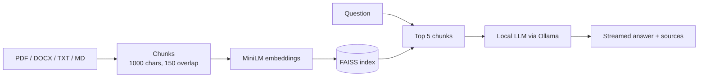
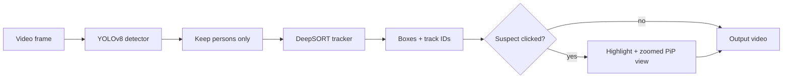

<picture>
  <source media="(prefers-color-scheme: dark)" srcset="assets/header-dark.svg">
  
</picture>

  

## 👨‍💻 About me

<table>
<tr>
<td width="55%" valign="top">
<picture>
  <source media="(prefers-color-scheme: dark)" srcset="assets/terminal-dark.svg">
  
</picture>
</td>
<td width="45%" valign="top">

- 🔭 Building **RAG_QA_System v0.3**: HTTP API, reranking and an evaluation gate
- 🎯 Heading for applied ML, coming in through MLOps
- 🛰️ At DRDO: real-time detection in PyTorch (35+ FPS on live video), NLP pipelines and a SLAM prototype
- 🐧 Daily driver: Arch Linux
- 📫 [harshitdeswal17@gmail.com](mailto:harshitdeswal17@gmail.com)

</td>
</tr>
</table>

  <picture>
    <source media="(prefers-color-scheme: dark)" srcset="https://raw.githubusercontent.com/harshit-05/harshit-05/output/github-snake-dark.svg">
    <source media="(prefers-color-scheme: light)" srcset="https://raw.githubusercontent.com/harshit-05/harshit-05/output/github-snake.svg">
    
  </picture>

## 🚀 Featured work

### 🔎 [RAG_QA_System](https://github.com/harshit-05/RAG_QA_System)

Local, config-driven Q&A over your own documents. Answers cite their sources and nothing leaves your machine.

`Python` `LangChain` `FAISS` `Ollama` `uv` `pytest` `mypy` `GitHub Actions`

- **Engineering:** config validated before anything loads; CI blocks on lint, types, tests (80% coverage floor) and a dependency audit
- **Honest limitation:** answers can misstate facts and faithfulness isn't measured yet (an evaluation gate is on the roadmap); on CPU, answers take minutes

### 🎯 [suspect_tracking_system](https://github.com/harshit-05/suspect_tracking_system)

Real-time person detection and tracking on CCTV footage. Click a bounding box to follow someone in a zoomed picture-in-picture view.

`Python` `PyTorch` `OpenCV` `YOLOv8` `DeepSORT`

- **Engineering:** detector and tracker are separate modules, with DeepSORT and ByteTrack wrappers behind one interface
- **Honest limitation:** `main.py` can't run until a pending ByteTrack fix lands; the DeepSORT evaluation pipeline works

<!-- TODO(harshit): OrienterNet-Location-Predictor and AI-Nav-SLAM-Explorer have empty READMEs.
     Add a short description of each here if you want them featured. -->

## Recent activity

Refreshed daily by a [workflow](.github/workflows/recent-activity.yml).

<!--START_ACTIVITY-->
- [harshit-05/RAG_QA_System](https://github.com/harshit-05/RAG_QA_System): docs(stories): close s2-1 and point the board at s2-2 (2026-10-02)
<!--END_ACTIVITY-->

## 🛠️ Tech stack

  <picture>
    <source media="(prefers-color-scheme: dark)" srcset="assets/stack-dark.svg">
    
  </picture>

## Contact

  
  

