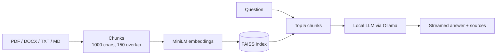
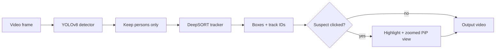

<h1 align="center">Harshit Deswal</h1>

  

  Third-year B.Tech student in Computer Science &amp; Communication Engineering (graduating 2027). 
  AI/Software Engineer intern at Teemo.ai. Previously AI research at DRDO's Young Scientist Lab.

## Featured work

### [RAG_QA_System](https://github.com/harshit-05/RAG_QA_System)

Local, config-driven Q&A over your own documents. Answers cite their sources and nothing leaves your machine.
CI blocks on lint, types, tests (80% coverage floor) and a dependency audit.

**Focus:** RAG · config validation · CI gates · reproducible setup with uv
**Honest limitation:** answers can misstate facts and faithfulness isn't measured yet (an evaluation gate is on the roadmap). On CPU, answers take minutes.

### [suspect_tracking_system](https://github.com/harshit-05/suspect_tracking_system)

Real-time person detection and tracking on CCTV footage. Click a bounding box to follow someone, with a zoomed picture-in-picture view.

**Focus:** object detection · multi-object tracking · interactive OpenCV UI
**Honest limitation:** `main.py` can't run until a pending ByteTrack fix lands. The DeepSORT evaluation pipeline works.

<!-- TODO(harshit): OrienterNet-Location-Predictor and AI-Nav-SLAM-Explorer have empty READMEs.
     Add a short description of each here if you want them featured. -->

## Recent activity

Refreshed daily by a [workflow](.github/workflows/recent-activity.yml).

<!--START_ACTIVITY-->
- [harshit-05/RAG_QA_System](https://github.com/harshit-05/RAG_QA_System): docs(stories): close s2-1 and point the board at s2-2 (2026-10-02)
<!--END_ACTIVITY-->

## Stack

Python · PyTorch · OpenCV · YOLOv8 · LangChain · FAISS · Ollama · FastAPI · PostgreSQL · AWS · Docker · GitHub Actions

## Contact

- Email: [harshitdeswal17@gmail.com](mailto:harshitdeswal17@gmail.com)
- LinkedIn: [harshit-deswal](https://linkedin.com/in/harshit-deswal/)
